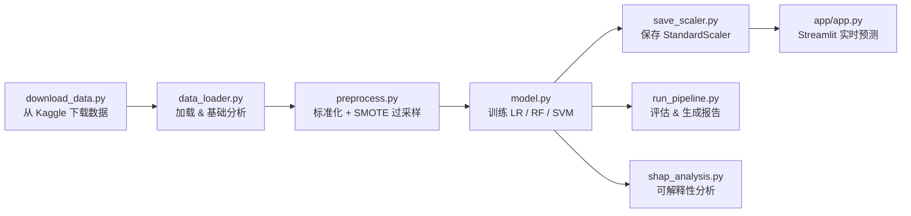

# 💳 信用卡欺诈检测系统 (Credit Card Fraud Detection)

> 基于机器学习与可解释性分析 (SHAP) 的信用卡欺诈实时检测系统

---

## 📋 项目简介

本项目基于 **Kaggle 信用卡欺诈数据集**，构建了一套完整的欺诈检测流水线：

- 自动化数据下载与预处理  
- 多模型训练与 5 折交叉验证  
- SMOTE 处理极端类别不平衡  
- 可视化评估（ROC / PR / 混淆矩阵）  
- **SHAP 可解释性分析**（特征归因、误分类诊断）  
- **Streamlit 交互式 Web 应用**（实时预测 + SHAP 解释）

>🎯 目标：在保证高召回率的同时，提供模型决策的可解释依据，适用于风控系统原型开发。

---

## 🛠 技术栈

| 类别 | 依赖库 | 用途 |
|------|--------|------|
| **数据处理** | `pandas`, `numpy` | 数据加载、清洗、转换 |
| **机器学习** | `scikit-learn`, `imbalanced-learn` | 模型训练、交叉验证、SMOTE 过采样 |
| **模型持久化** | `joblib` | 模型与标量器序列化存储 |
| **可视化** | `matplotlib`, `seaborn` | 混淆矩阵、ROC/PR 曲线绘制 |
| **可解释性** | `shap` | 特征归因分析、Summary/Force 图 |
| **Web 应用** | `streamlit` | 交互式前端预测界面 |
| **数据集下载** | `kagglehub` | 自动从 Kaggle 拉取数据集 |

---

## 📁 项目结构
credit_card_fraud_detection/
├── app/
│   └── app.py                      # Streamlit 交互式预测前端
├── src/
│   ├── download_data.py            # 自动下载 Kaggle 数据集
│   ├── data_loader.py              # 数据加载与EDA
│   ├── preprocess.py               # 标准化 + SMOTE
│   ├── model.py                    # 模型训练与交叉验证
│   ├── evaluate.py                 # 评估指标计算与可视化图表
│   ├── run_pipeline.py             # 端到端评估流水线
│   ├── save_scaler.py              # 导出StandardScaler
│   └── shap_analysis.py            # SHAP 可解释性分析
├── data/
│   └── raw/
│       └── creditcard.csv          # 原始数据集
├── models/
│   ├── rf.pkl                      # 训练好的随机森林模型
│   └── scaler.pkl                  # 标准化器
├── reports/
│   ├── classification_report.txt   # 分类报告（Precision / Recall / F1）
│   ├── roc_curve.png               # ROC 曲线图
│   ├── pr_curve.png                # Precision-Recall 曲线图
│   ├── confusion_matrix.png        # 混淆矩阵热力图
│   └── shap/                       # SHAP 可视化输出目录
│       ├── summary_beeswarm.png    # 特征重要性 beeswarm 图
│       └── force_*.png             # 误分类样本 force plot
├── notebooks/                      # Jupyter 探索性分析（预留）
├── requirements.txt                # Python 依赖列表
└── README.md                       # 本文件


---

## 🚀 快速开始

### 1. 环境配置

```bash
# 克隆仓库后，进入项目根目录
cd credit_card_fraud_detection

# 创建虚拟环境（若尚未创建）
python -m venv .venv

# 激活虚拟环境
.venv\Scripts\activate

# 安装所有依赖
pip install -r requirements.txt
```

### 2.下载数据集

```bash
python src/download_data.py
```
该脚本会通过 kagglehub 自动从 Kaggle 拉取数据集至 data/raw/creditcard.csv。若已存在则跳过下载。

> 数据集来源：[ULB Credit Card Fraud Detection](https://www.kaggle.com/datasets/mlg-ulb/creditcardfraud)
> 注意： 首次下载需要配置 Kaggle 认证。若网络较慢，可手动从 Kaggle 数据集页面 下载后放置到 data/raw/creditcard.csv


### 3. 训练模型

```bash
python src/model.py
```

>该脚本将完成以下操作:
>- 加载并预处理数据
>- 训练 3 个基线模型：逻辑回归、随机森林、线性 SVM
>- 对每个模型执行 5 折分层交叉验证，输出 Accuracy、Precision、Recall、F1、ROC-AUC
>- 将随机森林模型保存至 models/rf.pkl

### 4. 保存标量器

```bash
python src/save_scaler.py
```
> 该脚本会在训练集上拟合 StandardScaler 并保存至 models/scaler.pkl，供 Streamlit 前端对输入数据进行一致标准化。


### 5. 运行评估流水线

```bash
python src/run_pipeline.py
```

该脚本串联以下完整流程：
1. 加载 原始数据集 → load_data()
2. 预处理 数据（标准化 + SMOTE）→ preprocess()
3. 加载 已训练的随机森林模型 → joblib.load("models/rf.pkl")
4. 预测 测试集（标签 + 概率）
5. 生成并保存 以下评估文件至 reports/：📊 roc_curve.png — ROC 曲线（含 AUC 值）
- 📈 pr_curve.png — Precision-Recall 曲线（含 AP 值）
- 🔲 confusion_matrix.png — 混淆矩阵热力图
- 📝 classification_report.txt — 分类报告（含 Precision / Recall / F1-Score）

### 6. SHAP 可解释性分析

```bash
python src/shap_analysis.py
```

该脚本将：
- 使用 TreeExplainer 计算 SHAP 值
- 生成特征重要性 beeswarm 图 → reports/shap/summary_beeswarm.png
- 定位被误分类的欺诈样本，分析其 top-3 归因特征
- 生成 force plot 和 bar plot → reports/shap/


### 7. 启动 Streamlit Web 应用

```bash
streamlit run app/app.py
```

启动后浏览器将自动打开，您可以在侧边栏输入交易金额、时间及 PCA 特征（V1~V28），系统会实时显示：
- 🟢 正常交易 / 🔴 欺诈检测
- 欺诈概率（百分比 + 进度条）
- Top 5 SHAP 特征贡献柱状图

---

🔄 运行流程图


---

📊 评估指标说明

| 指标 | 含义 |
|------|------|
| **Accuracy** | 整体预测准确率 |
| **Precision** | 预测为欺诈的样本中，真正是欺诈的比例 |
| **Recall** | 真实欺诈样本中，被正确识别的比例（查全率） |
| **F1-Score** | Precision 与 Recall 的调和平均 |
| **ROC-AUC** | ROC 曲线下面积，衡量模型区分能力 |
| **Average Precision (AP)** | PR 曲线下面积，更适用于不平衡数据 |

---

⚙️ 数据预处理流程
1. 分离 特征 (X) 与标签 (y)
2. 划分 训练集 (80%) 和测试集 (20%)，按 stratify=y 保持类别比例
3. 标准化 Amount 和 Time 列（使用 StandardScaler）
4. SMOTE 过采样 训练集中的少数类（欺诈样本），平衡类别分布
5. 训练集 使用过采样后的数据，测试集 保持原始分布

---
  
📝 数据集说明
| 字段 | 说明 |
|------|------|
| `Time` | 距数据集中第一笔交易经过的秒数 |
| `V1` ~ `V28` | PCA 降维后的主成分（原始特征已脱敏） |
| `Amount` | 交易金额 |
| `Class` | 标签：`0 = 正常`，`1 = 欺诈` |
数据集共 284,807 条交易记录，其中仅 492 条为欺诈（占比约 0.17%），属于极端不平衡分类问题。
> 数据来源：Kaggle - Credit Card Fraud Detection

---

⚠️ 注意事项
- 原始数据文件 (data/raw/creditcard.csv) 为只读，请勿修改
- 所有代码使用相对路径，兼容 Windows / macOS / Linux 跨平台运行
- 确保虚拟环境 (.venv) 激活后再执行任何 Python 脚本